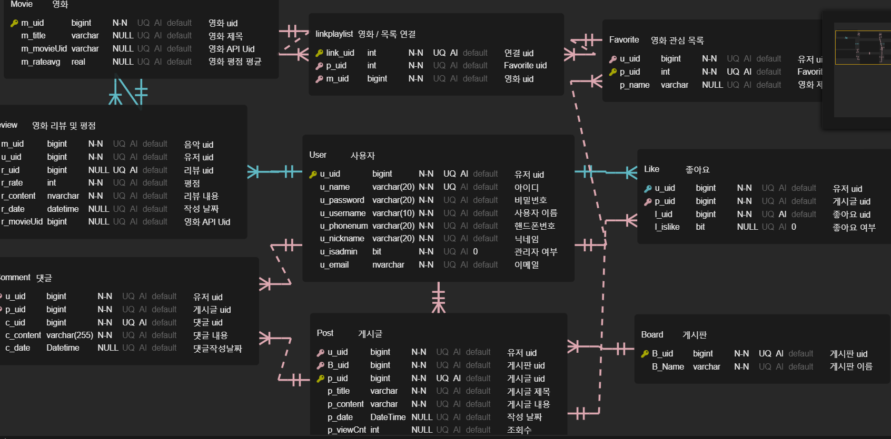
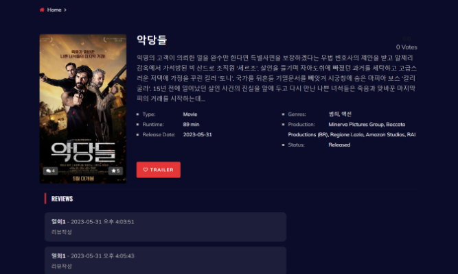
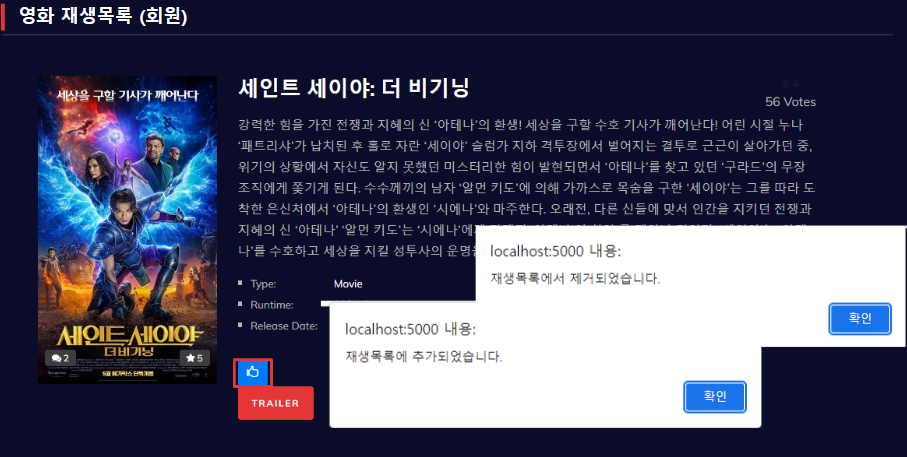
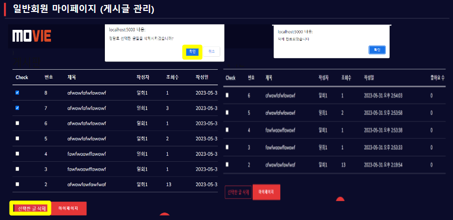
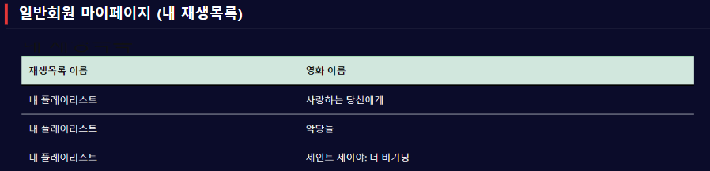
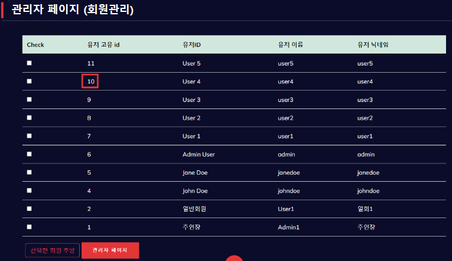
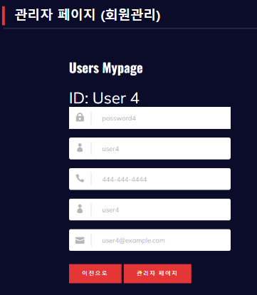
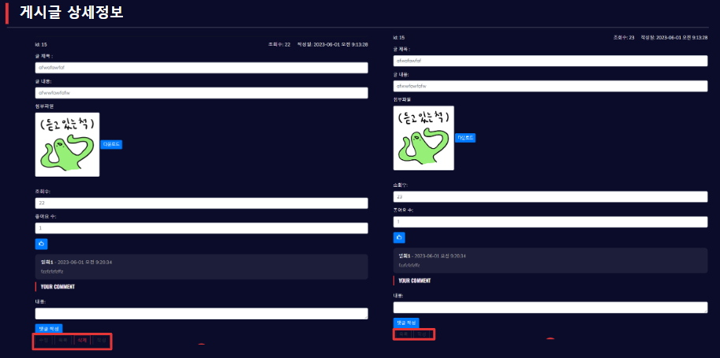
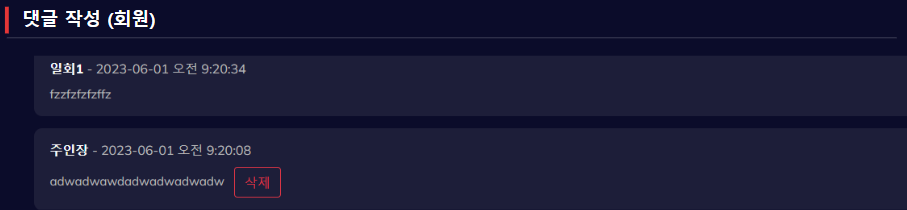

# **영화리뷰 웹 사이트**

## **개요**
- 영화 API를 통해 영화 상세정보와 리뷰,평점을 남길 수 있는 웹 사이트
- 자유게시판을 통해 유저간의 소통 가능
- 

## **개발 환경 및 활용 기술**
- HTML, CSS, JavaScript 를 이용한 WEB 구현
- BootStrap, Ajax, JSON, jQuery
- ASP.NET Core MVC Model
- SSMS 데이터베이스 
- Session
- TMDB API, 한국영화 진흥위원회 API

## **공헌한 내용**
- 참여도 40%
- 데이터베이스 설계
- 관리자 페이지 (회원 정보 , 모든 게시글 관리 , 모든 댓글 관리 , 모든 리뷰 관리)
- 마이 페이지 ( 내 게시글 관리 , 내 댓글 관리 , 내 저장목록)
- 글 작성 시  파일 첨부 
- 게시글 좋아요 / 취소
- 댓글 작성 / 삭제
- 영화 저장목록 추가/삭제

 

### **[제작 시연 영상]**

 

[ 시연 & 발표영상 Link ]: https://youtu.be/eLDauLhBbwQ

 
 

## 발표자료 PPT

## ERD

  

## 영화 상세정보

  

  

- 영화 상세정보에서 리뷰와 내 플레이리스트에 추가할 수 있도록 구현

    

## 마이페이지

  

  

- 마이페이지에서 내가 작성한 게시글,댓글 내가 추가한 플레이리스트 보거나 관리할 수 있도록 구현

    

## 관리자페이지

  

  

- 관리자페이지에서 유저들에 대한 방출이나 유저의 정보를 볼 수 있도록 구현.
- 모든 게시글이나 리뷰관리가 가능하도록 구현.

## 게시물

  

  

- 게시글의 상세페이지에서 내가 작성한 글, 댓글만 삭제하거나 수정할 수 있도록 구현. 
- 게시물 작성시 첨부파일 첨부 가능하고 다운로드 가능. 댓글작성 구현
